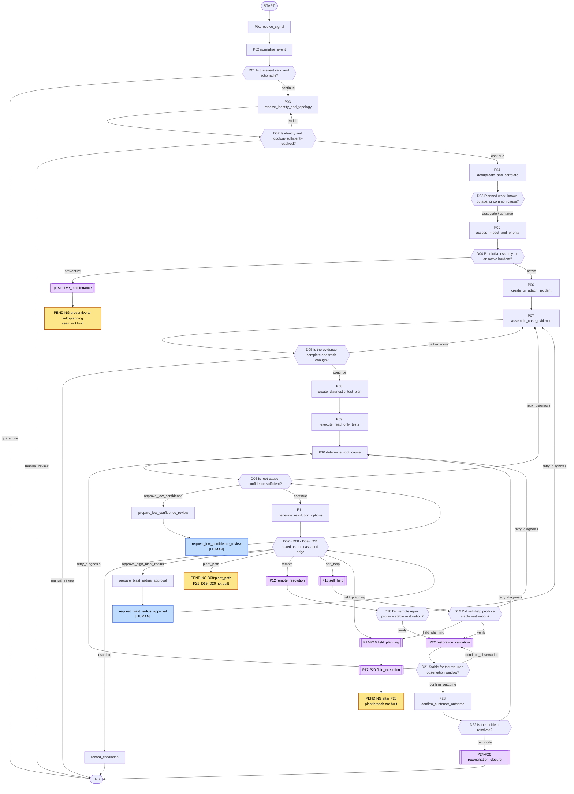
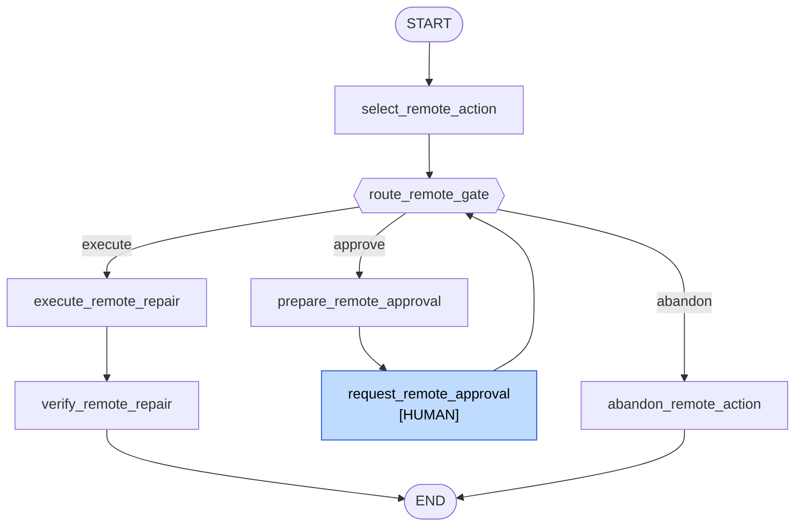
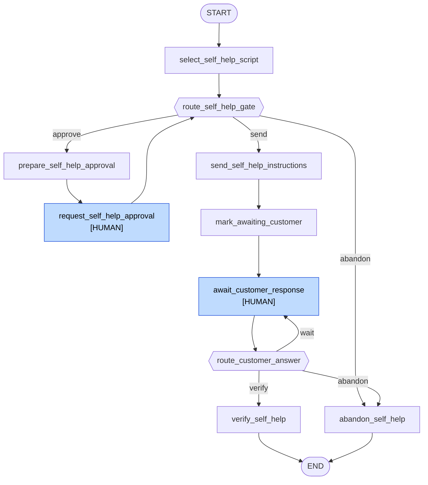
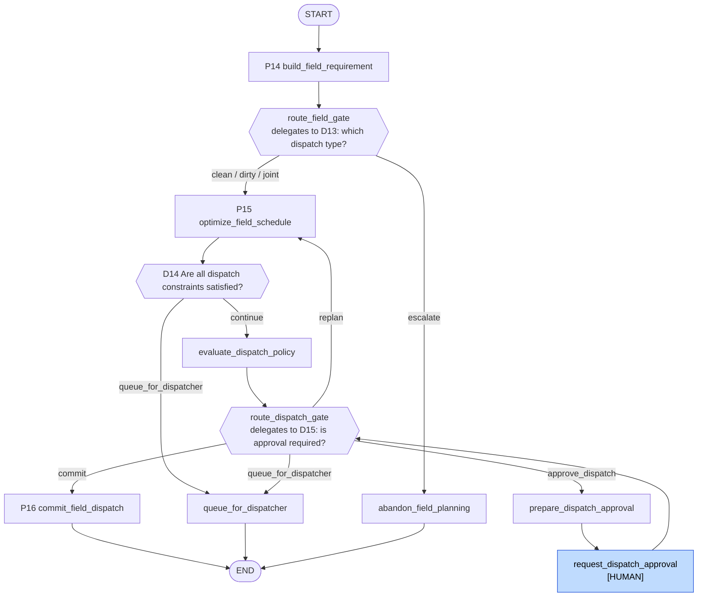
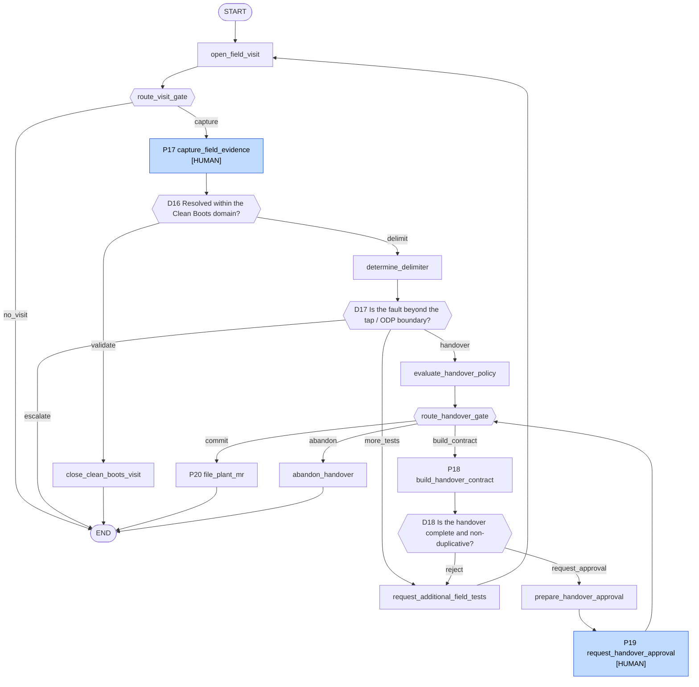
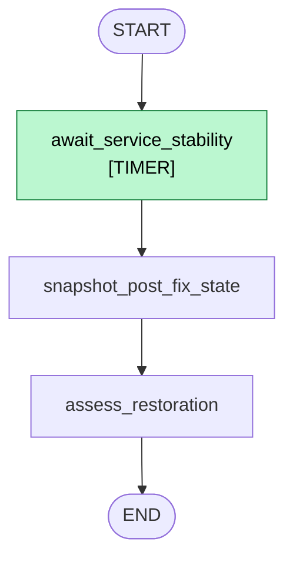
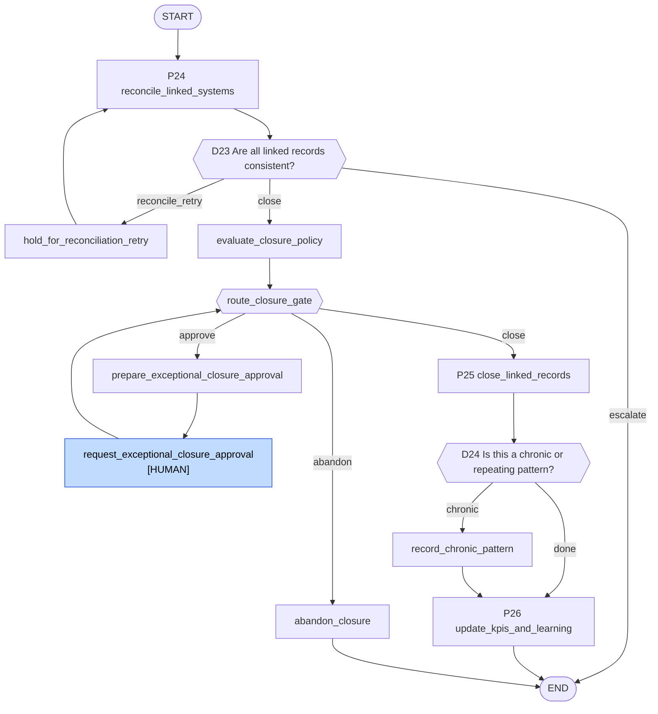
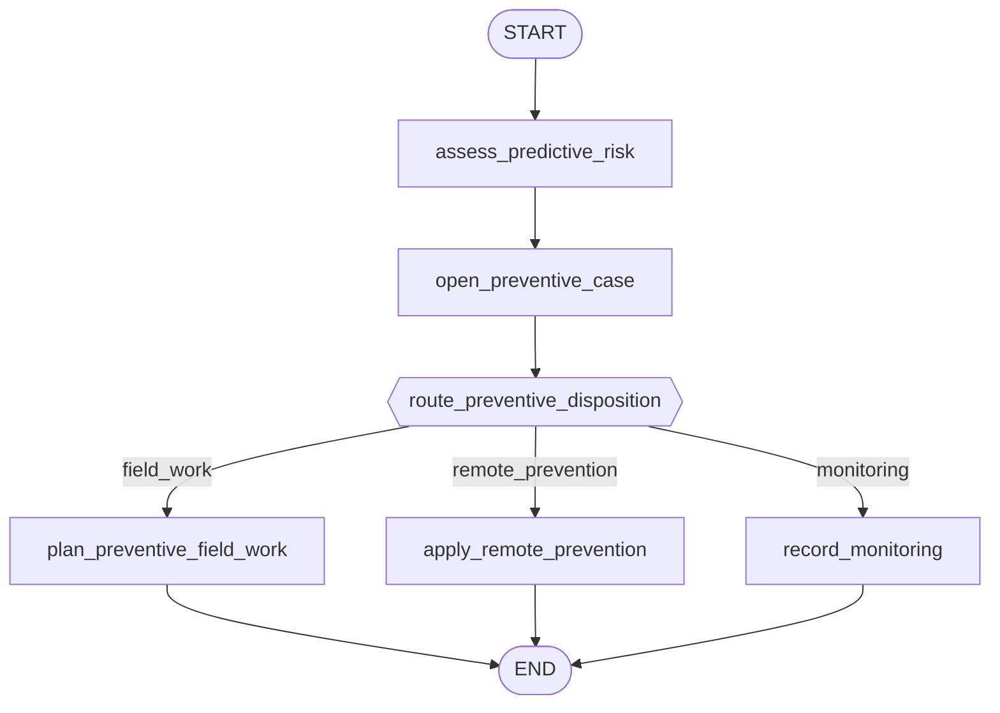

# The workflow, drawn

**Status: measured on 2026-08-20 against the tree at `a1015f4`.** Every node, edge and branch label
below was read out of the wiring tables, not transcribed from the specification. Where the drawing
and `docs/specification.md` disagree, the drawing is what the code does and the disagreement is
listed in §5.

## 0. How this was derived, and why not from `draw_mermaid()`

`compiled.get_graph().draw_mermaid()` exists and would have been one line. It is not used here, and
the reason is measured rather than stylistic: `get_graph()` **drops conditional-branch labels**. A
diagram produced that way shows the edges out of `generate_resolution_options` but not which answer
takes which, and the answers are the whole content of a decision graph. It also cannot show a
subgraph's interior without a second call per subgraph, and it cannot distinguish an `END` that is
the design from an `END` that is an unbuilt stage — which is exactly the question §5 answers.

So the source of truth for this document is the tables the builder itself wires from:

| Drawn from | Table |
| --- | --- |
| Parent step order and the plain edges between them | `graph/nodes/PARENT_NODES`, `builder._plain_edges()` |
| Which of the parent's nodes are compiled subgraphs | `builder.SUBGRAPH_NODES` |
| Which decision is asked after which node | `builder.DECISION_AFTER` |
| Where each answer goes | `builder.BRANCH_TARGETS` |
| The question text on each decision | `routing.DECISIONS[...].question` |
| Which exits are unbuilt rather than deliberate | `builder.PENDING_STAGES`, `_DELIBERATE_TERMINALS` |
| Subgraph interiors | the `add_edge` / `add_conditional_edges` call sites in `graph/subgraphs/*.py` |

To re-derive it, `python -m lpr_cpe.cli topology` prints the parent's shape. **Its `P01..P17` labels
are positional indices into `PARENT_NODES`, not specification P-numbers** — it prints `P12
confirm_customer_outcome`, which the specification calls P23. This document uses specification
numbers throughout. That mismatch is a trap worth knowing about before comparing the two.

A second trap, recorded because it caught an earlier audit: **grepping for a router's function name
misreports in both directions.** Measured by comparing a text search of `graph/` against the names
each file's *bytecode* actually references. A grep finds 18 of the 24 wired; the true figure is 22,
and the two sets differ by six. Five decisions — D03, D05, D08, D09 and D11 — name their router
nowhere outside `routing.py`, because the parent wires them through ID-keyed tables, so grep calls
them unwired and they are not. One — D19 — appears only inside a docstring, `field_execution`'s note
on why it stops short of P21, so grep calls it wired and it is not.

What makes that hard to notice is how often grep is right for the wrong reason: nine more decisions
(D01, D02, D04, D06, D07, D10, D12, D21, D22) are docstring-only as well and happen to be wired, and
D20 names its router nowhere and happens to be unwired. Same two signals, opposite verdicts.

Subgraphs add a third shape: D13 and D15 are reached by *delegation* — `route_field_gate` and
`route_dispatch_gate` each end in `return route_...(state)` — never by a direct
`add_conditional_edges`. The counts below come from the topology report and the subgraph call sites,
not from grep.

---

## 1. The short answer: nearly, and one named block is missing

**25 of the specification's 26 process steps are built. 22 of its 24 decisions are wired.** The path
from a signal arriving to an incident closed, reconciled and labelled runs end to end. What is
missing is the plant-repair branch.

| | Declared | Built / wired | Missing |
| --- | --- | --- | --- |
| Process steps | 26 | 25 | P21 |
| Decisions | 24 | 22 | D19, D20 |
| Approval kinds with a gate | 6 | 6 | — |

The three missing items are one contiguous block: **P21 + D19 + D20**, the Dirty Boots / plant / OSP
/ NOC execution branch and the two questions that follow it. It is reached from two directions — by
`D08:plant_path` at the parent, and by whatever should follow P20's jTrack MR inside
`field_execution`.

Nothing about that absence is implicit. `builder.PENDING_STAGES` names the three exits that reach it
or wait on it, and `_check_pending_stages` fails the build if a terminal node is neither listed nor
declared deliberate in `_DELIBERATE_TERMINALS`. The gaps are drawn as `PENDING` boxes below rather
than as `END`.

---

## 2. The parent graph

24 nodes: 17 process steps plus 7 compiled subgraphs. `[[double-bordered]]` boxes are subgraphs,
expanded in §3. `[HUMAN]` marks a node that raises `interrupt()` and waits for a person; `[TIMER]`
one that waits on the clock.

### Three things in that picture that are not obvious

**The four questions after P11 are one edge, not four.** LangGraph allows a node to carry only one
`add_conditional_edges`, and D07, D08, D09 and D11 are asked in sequence with no node between them.
`builder._cascade` composes them: it asks D07, and while the answer names another decision it asks
that one too, so what reaches the edge is always a real target. Composing is exact rather than an
approximation because no node runs between the questions — each reads the state the one before it
read, and a router's return value is never checkpointed.

**Every approval gate is two nodes, and the second one loops back to the same question.** `prepare_*`
builds the payload, `request_*` raises the interrupt and records the answer, and the edge out of
`request_*` re-asks the decision that sent it there. That is why `RLC` points back at `D06` and `RBR`
back at the cascade. The split exists because everything before `interrupt()` re-runs on resume, so a
node that both built the question and waited would build a different question each time.

**`reconciliation_closure -> END` is the end of the workflow, not a gap.** It is one of the two
entries in `_DELIBERATE_TERMINALS`, alongside `record_escalation`. Its main line ends at
`update_kpis_and_learning`, which writes `IncidentStatus.CLOSED`, and `domain.lifecycle` gives
`closed` no outward transition — so there is not merely no next node but no legal one. That table
exists because a terminal node had no other way to be excused: without it the only way to declare one
was a `PENDING_STAGES` line claiming work was owed, which for these two would be false.

---

## 3. Inside the seven subgraphs

Every subgraph router is wrapped in `guarded(...)`, which answers `ESCALATED` when the budget is
spent — `policy.attempt_limits.max_subgraph_reentries`, measured at 6. Those `ESCALATED -> END` edges
exist on **every** conditional edge below and are omitted from the drawings, which would otherwise be
half guard.

### P12 — `remote_resolution`

### P13 — `self_help`

### P14-P16 — `field_planning`

`field_planning` is the only subgraph with a successor wired at the parent —
`SUBGRAPH_SUCCESSOR = {"field_planning": "field_execution"}`. It needs a table entry rather than a
position because a subgraph has no place in `PARENT_NODES` for `pairwise` to read.

### P17-P20 — `field_execution`

The handover policy is evaluated **before** P18 builds the packet, while the incident is still
`field_in_progress`. `field_in_progress -> awaiting_approval` is a refused transition, so P18 has to
write `awaiting_handover` first — which means the policy verdict must be taken on the state that
precedes it.

### P22 — `restoration_validation`

Three nodes, linear, no decisions inside — the question it exists to answer is D21, and D21 is asked
at the parent on the way out. The wait is a node of its own because everything before `interrupt()`
re-runs on resume, so a node that both waited and snapshotted would re-snapshot on every resume.
`Command(resume=...)` is consumed per `interrupt()` call, so the `while now < deadline: interrupt()`
loop re-pauses on a resume that arrives early rather than falling through.

### P24-P26 — `reconciliation_closure`

Nine nodes, and three properties of the shape are load-bearing. **The retry edge is the graph's only
cycle and it returns to the reader**, so a retry re-reads the six linked systems rather than
re-judging a stale result; the loop is bounded by `ReconciliationPolicy.max_retries`, not by the step
budget. **Both gate nodes route through the same map**, so the arm that closes and the arm that asks
cannot be wired apart. And **`abandon_closure` is a leaf** — nothing follows a closure this stage
refused to perform.

`route_closure_gate` has a fourth answer that is easy to miss: a policy demand this stage does not
own. `low_confidence_rca` belongs to D06's gate, on the parent and upstream of here, so an incident
whose RCA is weak but whose validation passed reaches `abandon_closure` with the outcome
`unanswerable` and escalates to a human. That is not a gap — it is the alternative to closing an
incident the policy engine explicitly refused to allow — and
`tests/unit/test_subgraph_reconciliation_closure.py` pins it against a real fixture.

P25 and P26 are two nodes rather than one for a reason the lifecycle table forces:
`TRANSITIONS[reconciling]` does not list `closed`, while `TRANSITIONS[resolved]` does. So
`close_linked_records` writes `resolved` and `update_kpis_and_learning` writes `closed`; collapsing
them raises `IllegalTransitionError` on the write itself.

### `preventive_maintenance`

All three dispositions end the thread. `plan_preventive_field_work` is the seam that ought to reach
`field_planning` and does not — see §5.

---

## 4. Where a human or a clock stops the graph

Ten sites raise `interrupt()`. Seven are approval gates and share one implementation,
`graph.interrupts.request_approval`; three are waits of their own.

| Site | Graph | Kind |
| --- | --- | --- |
| `request_low_confidence_review` | parent | approval — `low_confidence_rca` |
| `request_blast_radius_approval` | parent | approval — `high_blast_radius_action` |
| `request_remote_approval` | `remote_resolution` | approval — kind read from the decision |
| `request_self_help_approval` | `self_help` | approval — kind read from the decision |
| `request_dispatch_approval` | `field_planning` | approval — `dispatch` |
| `request_handover_approval` | `field_execution` | approval — `clean_to_dirty_handover` |
| `request_exceptional_closure_approval` | `reconciliation_closure` | approval — `exceptional_closure` |
| `await_customer_response` | `self_help` | waits for the customer, with an adapter fallback |
| `capture_field_evidence` | `field_execution` | waits for the technician, **no** adapter fallback |
| `await_service_stability` | `restoration_validation` | waits on the clock |

All six `ApprovalKind` members now have a gate. Five of the six name their kind as a literal; the
remote and self-help gates take theirs from the policy decision, which is why
`routing.DEDICATED_GATE_APPROVAL_KINDS` exists. It lists the five kinds a variable-kind gate must
*decline* rather than approve on another gate's behalf — `low_confidence_rca`,
`high_blast_radius_action`, `dispatch`, `clean_to_dirty_handover` and `exceptional_closure` — leaving
`high_risk_remote_action` as the only kind those two may serve. The AST guard in
`tests/unit/test_routing.py` enforces the list against the gates that exist.

`prepare_exceptional_closure_approval` names `EXCEPTIONAL_CLOSURE` as a literal even though
`route_closure_gate` cannot reach it under any other kind — measured by swapping the literal for the
decision's field, which changed nothing. What the literal buys is that the kind asked and the kind
later looked for are the same token.

---

## 5. The three open exits, with what each is waiting on

These are `builder.PENDING_STAGES`. The builder's own entries are longer than what follows; each is
summarised here and quoted in full by `python -m lpr_cpe.cli topology`.

**`D08:plant_path`** — the NOC, provisioning and plant branch. Stage 4's Dirty Boots half, P20
onwards, which creates or updates an MR from NOC and plant evidence rather than from a handover
contract. P21 is the unbuilt step, and the two questions after it are D19 *"Did the Dirty Boots or
plant action restore the affected network domain?"* and D20 *"Is customer service still degraded
after plant restoration?"* Both are declared in `routing.DECISIONS` and wired nowhere.

**`__onward__:field_execution`** — the same branch seen from the other side, and the entry that
records why it is a missing *capability* rather than a missing afternoon.
`jtrack.simulator.create_mr` returns an MR at `submitted`, and nothing in `src` calls `update_mr`,
which is the only method that moves one. So D19 would answer `await_plant` for every incident that
ever reached it, and the whole of D20 would sit behind an arm no state can enter — the same dead
clause the mutation sweep had removed from `route_delimiter_evidence`. What is missing is an
OSP-side status feed; see `docs/vendor-integration-gaps.md`.

The stage's three exits then stop for three different reasons, which is worth separating:

* `file_plant_mr` ends with the MR filed and the incident at `mr_raised` — that is the wait above.
* `close_clean_boots_visit` writes `validating`, the state Stage 5 begins from, and **Stage 5 now
  exists**. What it waits on is D20, the decision that would route a restored plant case into it,
  and D20 is inside this same unwritten stage.
* `abandon_handover` waits on no stage at all. It writes `diagnosing`, and P07 and P10 both exist —
  what is missing is an edge back to them, which the parent cannot draw while the specification
  defines no decision at the end of the Clean Boots arm.

**`__onward__:preventive_maintenance`** — the seam from a preventive disposition into field planning.
P14 exists, but nothing routes into it from here. `plan_preventive_field_work` records that a visit
is warranted and stops: it writes the suspected domain and the crew `boundaries.crew_for` derives,
which is exactly what `build_field_requirement` consumes, but a preventive case has no
`resolution_plan` and no `ResolutionOption` for P14 to select, so the two cannot be joined by an edge
without first deciding what a preventive `ResolutionOption` is.

### What is no longer open

`D22:reconcile` was the fourth entry in this list until 2026-08-19. Stage 5's closure half — P24's
reconciliation, D23, P25's controlled closure, P26's labelling and D24 — is built and wired, and
`ReconciliationPolicy.systems` no longer names `service_platform`, an entry no adapter served and
which by itself held every incident short of closure through three retries and then escalated it.

---

## 6. What "complete" means for the part that is built

The reachable path — signal in, through diagnosis, through one of remote repair / self-help / field
work, through post-fix validation and customer confirmation, to a reconciled and labelled closure —
is whole, and every branch off it either reaches a real node or reaches one of the three boxes above.
There are no dangling edges and no node without a predecessor; `builder._check_tables`,
`_check_chains` and `_check_pending_stages` raise `GraphTopologyError` at build time if that stops
being true, so it is checked on every import rather than asserted here.

One caveat that the topology cannot show: **no fixture drives the parent all the way into Stage 5.**
Swept over all 41 fixture services under three case profiles, 20 stop at `validating`, 20 at
`diagnosing` and one escalates. The simulator derives telemetry from each service's static `health`
field, so no repair this workflow performs changes a reading, `assess_restoration` scores every fix
as having cleared 0% of the anomaly, and D21 answers `retry_diagnosis` until the resolution budget
escalates. Stage 5 is therefore covered by seeding P22's `ValidationResult` onto a real parent run —
see `tests/unit/test_subgraph_reconciliation_closure.py`. Making a fixture restore is a simulator
change, not a graph one.

The gate on 2026-08-20, from the repo root, all four exiting 0: `ruff check`, `ruff format --check`
(130 files), `mypy --strict src/lpr_cpe` (106 source files), `pytest` (888 passed).
